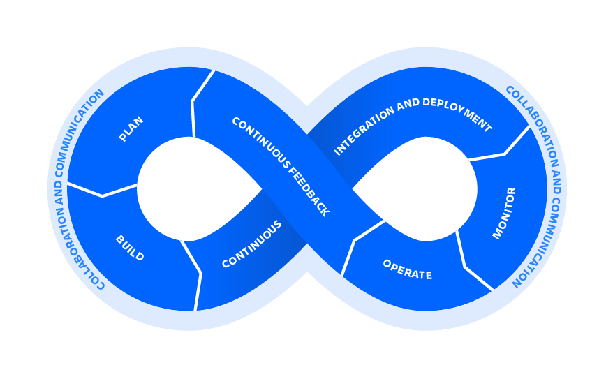

# What is DevOps?

DevOps is a set of practices that works to automate and 
integrate the processes between software development and IT 
teams, so they can build, test, and release software faster 
and more reliably. The term DevOps was formed by combining the
words “development” and “operations” and signifies a cultural 
shift that bridges the gap between development and operation 
teams, which historically functioned in siloes.
 

# The roadmap to become Junior DevOps engineer in 

## #1 - Linux basics

### Commands to learn

 You can choose any distro you want. You can try all of them with vmware or virtualbox. Ubuntu or Pop is good option to start with.

- Version Control
    - git 
      - git add 
      - git commit
      - git pull
      - git fetch
      - git branch
      - git checkout
      - git push
      - git remote
      - git revert
      - git merge
- User permissions and management
    - adduser
    - usermod
    - chown
    - chmod
- Process management
    - ps
    - top / htop
    - lsof
    - kill
    - pkill
- Text manipulation
    - cat
    - grep
    - vim (vimtutor at least 5 times)
    - unix pipelining 
    - xarg
    - awk
- File, Dir management
    - rm
    - mv
    - sed
    - cp
    - ranger
- Disk
    - df
    - du
    - ncdu
- Networking
    - ping
    - netstat
    - nmap
- Folders
    - /etc
    - /var/log
    - /home
    - $PATH
    - aliases ( .zshrc )
  
### Shell scripting

- Watch any shell script tutorial on youtube, read articles.
    - You must know  to write logical functions with above linux commands.
- Try to do below tasks:
    - 1
    - 2

### Makefiles
- Basic understandig of Makefile

### Books to read

-  Linux Bible last edition

## #2 Scripting language - Python 3

You should understand Python basics, how it works, manipulation with files, dirs, unix commands and etc.

You must read the book - **Python for Devops from Noah Gift**.

- Complete the tasks below and you can go further, no need to read the whole book in this part of roadmap. Get familiar with Python and continue reading it.
    - 1. 
    - 2. 
 
## #3 - SSH

- Generate pem files
    - Generate ssh key-pair
    - Copy public key to authorized keys
    - Save private key as .pem file
- Generate keys 
- Key file permissions 
- Private and public keys 
    - Understand how they work
- COPY files by ssh `scp`  and `rsync`
- Run remote shell script 
- Connect to database ssh 
- SSH tunneling

## #3 - Networking basics

- TCP / IP
- OSI Model
- Domains
    - DNS
    - DNS Record types
- HTTP / HTTPS 
    - SSL certificates
    - Generate certificate with certbot and cert-manager
- FTP
- Mailing protocols
  - POP
  - IMAP
  - SMTP
- TCP / UDP
  - Diffirences between them

Watch the playlist below from youtube.

- [Networking fundamentals](https://www.youtube.com/watch?v=cNwEVYkx2Kk&list=PLDQaRcbiSnqF5U8ffMgZzS7fq1rHUI3Q8) from Network Direction channel

## #4 - Web server

- Web server base concepts 
- Nginx
  - Config files / logfiles
  - Reverse proxy
  - SSL certificates
- Understading of load balancing 
- Deploy simple frontend project with nginx (`frontend_sample` directory in repository)
  - Run project (read Readme.md)
  - Proxy a port of the service to the domain (test.roadmap.udevs.io)
  - Generate ssl certificate for this domain
  - Track the access logs

##  #5 - Containerinzation

### Docker
  - Understanding the main concept of Docker
    - Images
    - Containers
    - Docker daemon
  - Commands to learn
    - docker build
    - docker tag
    - docker push
    - docker run
    - docker pull
    - docker exec
    - docker logs
    - docker volumes
    - docker inspect
  - Container registries
    - Login / Logout
    - dockerhub
    - self-hosted registries
    - Gitlab container registry
  - Dockerfile
    - Understanding of Dockerfile
    - Syntax
##### Tasks to do:
  - Create Dockerfiles for sample Go (`go_sample`) and Node.js (`node_sample`) projects, build images and push them to your dockerhub account with `roadmap` tag.
  - Track the logs by running your image in detached mode.

## #6 Deployment of microservices with docker-compose and docker swarm

### docker-compose

- Understanding the usage of docker-compose
- docker-compose up / down
- Port-forwarding
- Environment variables
- Networking between containers
- Build the containers from context and image
##### Read the docs and try to do below tasks:
  - Deploy microservices and database with docker-compose:
    - Try to write docker-compose for simple microservices, database (PSQL) and API gateway in `micro_sample`
    - Up the docker-compse from images
    - Connect services to API gateway with Env variables. Check out the config files in microservices.
    - Expose the API gateway port and check the result from your browser.

### Docker swarm
  
- Virtualization / containerinzation 
- 12 factors 
- Writing dockerfiles 
- docker images: 
    - build 
    - pull 
    - push
    - registry login / logout 
- Containers 
    - run 
    - logs 
    - volumes 
    - inspect 
    - execute into container 
    - run from image 
- Networking
- docker-compose 
    - write 
    - build 
    - docker compose service discovery 
    - docker compose up / down 
- Swarm / Kubernetes 
    - kubernetes theory 
    - service concept
    - service discovery
    - stack 
    - stack deploy 
    - inspect service 
    - service update (add env, remove env, update image, —with registry auth) 
    - service rollback 
    - scaling (theory)

## Skills #6 - CI

- Pipeline tasks (migrations, build, test, code analyse and etc) 
- Builing docker image in docker. Using and theory 
- Working with registry push/pull/ login/logout 
- CI/ CD

## Skills #7 - Monitoring

- Monitoing theoury. Pull, push  models 
- Prometheus exporters 
- Prometheus Query Language 
- Using Grafana 
- Alerts

## Skills #8 - Log management

- Logging format, how to log application, properly 
- Log parsing fluentbit, elastic beats 
- Elastic search 
- Kibana

## Skills #9 - Cloud

- AWS
- IAM 
- EC2
- S3 
- RDS 
- LAMBDA / Serverless 
- Cloud registries 
- Elastic Beanstalk 
- Virtual private cloud (Amazon)
- VDS/VPS hypervisor

##### Besides, all of this above, you should totally understand version control system (Git).

##### Good luck!
