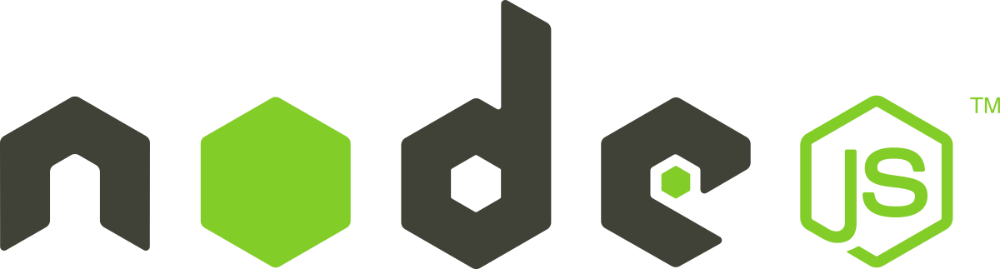

# What is NodeJS?

Node.js is an open-source, cross-platform, back-end JavaScript runtime environment that runs on the V8 engine and executes JavaScript code outside a web browser.

# The road map to become successful Nodejs engineer

# Requirements

- Install latest stable version of [Ubuntu]
- Install [nodejs]
- Install [mongodb]
- Install [mongodb-compass]

## Skills #1 - Learning syntax

- [An Introduction](https://javascript.info/getting-started)
- [JavaScript Fundamentals](https://javascript.info/first-steps)
- [Code quality](https://javascript.info/code-quality)
- [Objects: the basics](https://javascript.info/object-basics)
- [Data types](https://javascript.info/data-types)
- [Advanced working with functions](https://javascript.info/advanced-functions)
- [Classes](https://javascript.info/classes)
- [Error handling](https://javascript.info/error-handling)
- [Promises, async/await](https://javascript.info/async)
- [Generators, advanced iteration](https://javascript.info/generators-iterators)
- [Modules](https://javascript.info/modules)

## Skills #2 -

- [Fibonacci](./skills2/fibonacci/readme.md)
- [FizzBuzz](./skills2/fizzbuzz/readme.md)
- [Palindrome](./skills2/palindrome/readme.md)
- [Odd even sum](./skills2/oddevensum/readme.md)
- [Has duplicate element in array](./skills2/hasduplicate/readme.md)
- [Filter the odd numbers from array of numbers](./skills2/filterodd/readme.md)
- [Map the numbers into JSON objects](./skills2/mapnumbers/readme.md)
- [Sort the given numbers](./skills2/sortarray/readme.md)

## Skills #3 - Git

- Learn git commands
- Repo
- Remote

## Skills #4 - Tasks for git

- Generate ssh key and add git account(one of them github, bitbucket, gitlab)
- Init
- Add
- Commit
- Add remote
- Push
- Pull
- Resolve conflict
- Merge request
- Revert, reset

## Skills #5 - Express.js

#### You should use mongodb as a storage, and mongoose as lib

- Contact List (Create, Update, Delete, List, Get)
- Task List (Create, Update, Delete, List, Get)

## Skills #6 - gRPC, protobuffers

#### You should use mongodb as a storage, and mongoose as lib

- Create Hello World example with protbuffers and gRPC
- Contact List (Create, Update, Delete, List, Get)
- Task List (Create, Update, Delete, List, Get)

## Skills #6 - Docker

- Docker
- Install
- Pull image
- Run image
- Docker-compose

##### Good luck!

[ubuntu]: https://ubuntu.com/
[nodejs]: https://nodejs.org/
[mongodb]: https://www.mongodb.com/3
[mongodb-compass]: https://www.mongodb.com/products/compass
